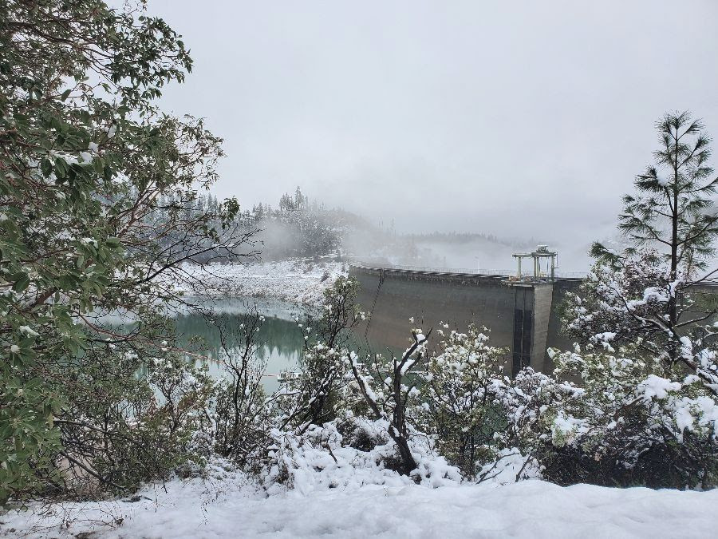
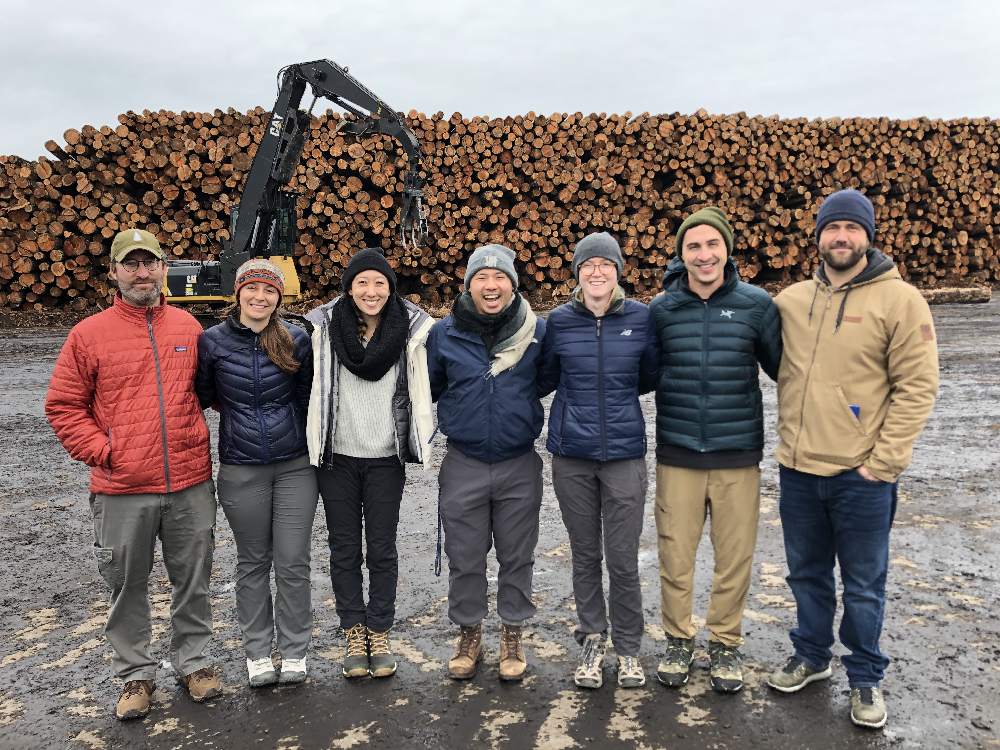

This December, my Group Project team and I had the opportunity to visit the our Group Project study region, the Tahoe-Central Sierra. We meet our client, Blue Forest Conservation in Bullard's Bar Reservoir and toured a number of sites in the Yuba Watershed to discuss various project sites, wildfire impacts, restoration goals and the resevoir itself!

After discussing sedimentation and woody debris impacts to reservoir operations, we toured the Pendola Fire burn area where active restoration was taking place to reduce erosion and sediment into the reservoir.

On our second day, we meet with the general manager at Sierra Pacific Industries, where we toured their lumber mill and cogeneration facility. We learned about operations, discussed the impacts of wildfire risk to operations and toured the facility.

