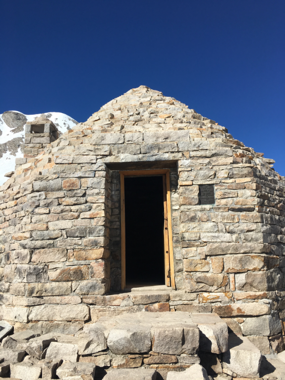
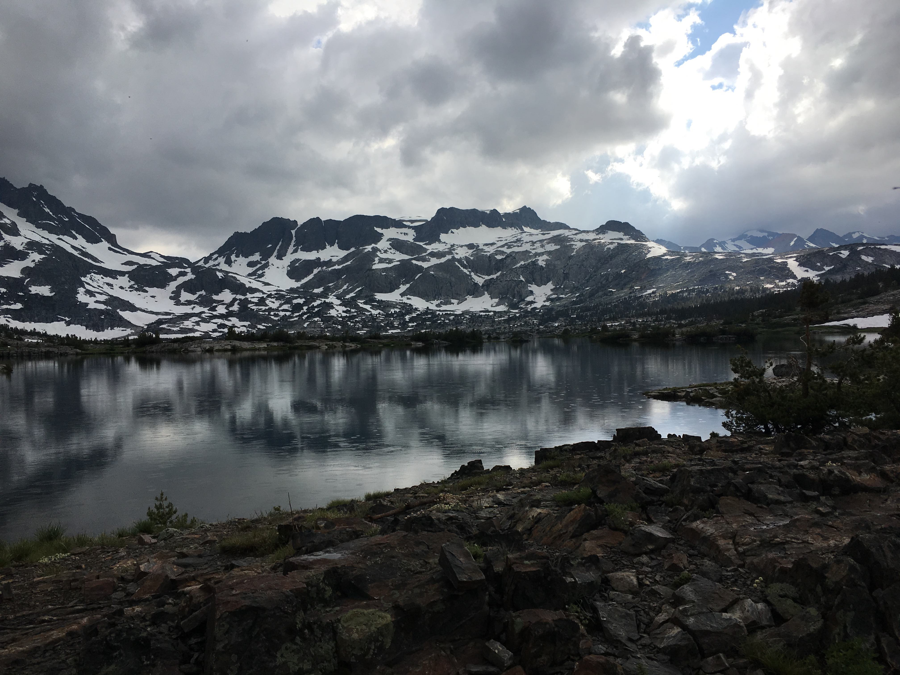

In the summer of 2019, I had the opportunity to hike the John Muir Trail from south to north. Typically, folks prefer to start in Yosemite Valley and head south, but permits were pretty competitive so we opted to start just south of Mount Whitney and head north. The Sierra got some unusual late snow at the end of May, which set us up for a more challenging hike. It complicated our itinerary a bit, but was an incredible experience that I wouldn't trade for anything.

