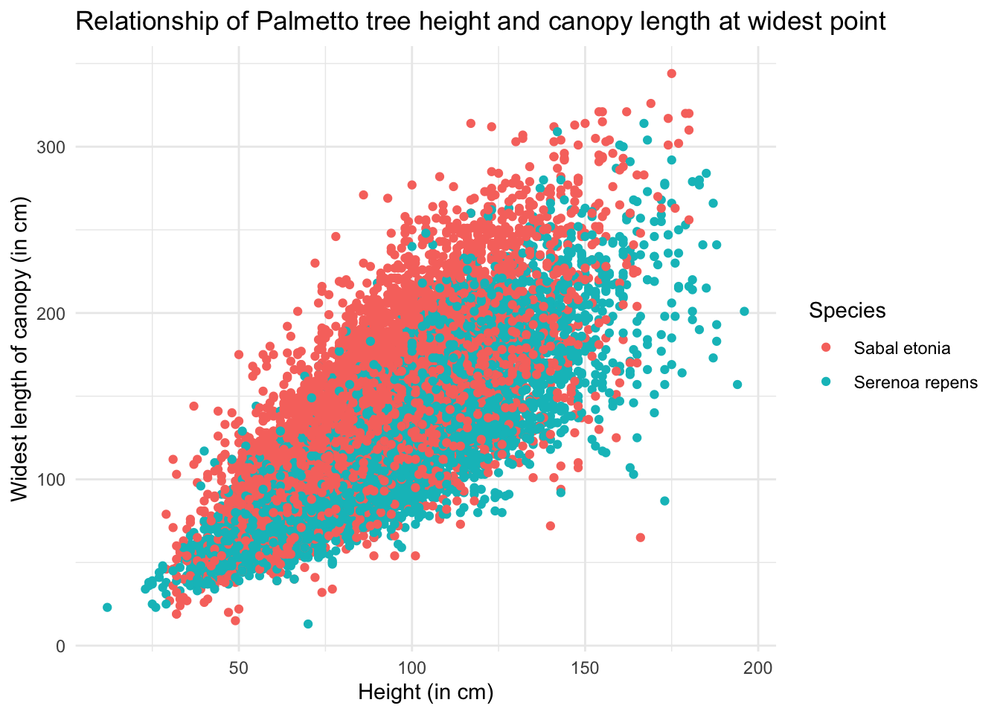
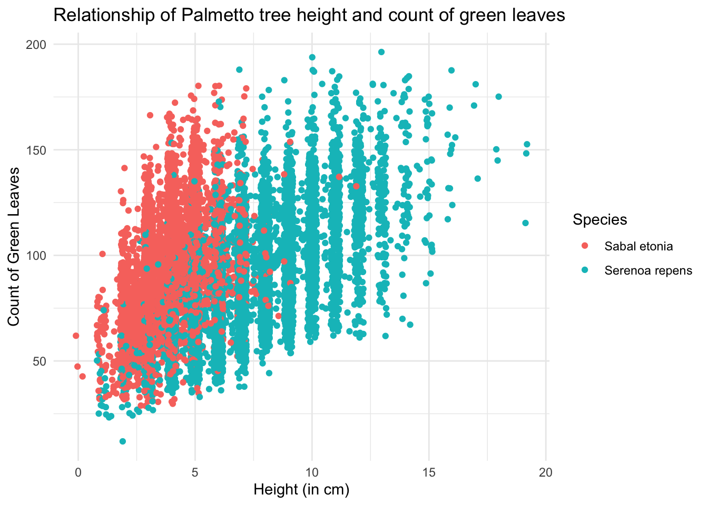

# Florida Palmetto Species

This anaylsis will utilize data from Abrahamson, 2019, on Florida palmetto characteristics. We will use binary logistic regression to test feasibility of using variables plant height, canopy length, canopy width, and number of green leaves to classify whether a palmetto is *Serenoa repens* or *Sabal etonia*.

## Exploratory Data Visualization

From our exploratory analysis of the variables, we can see that the number of green leaves seems to have the greatest impact on determining the difference between the species from the variables we have analyzed. Height, width and length do not produce noticeable differences between species.

## Binary Logistic Regression Analysis
Based on these plots the number of green leaves are more likely to help classify species correctly, but to be sure we will perform a binary logistic regression to determine the probability of a plant being either Serenoa repens or Sabal etonia based on these predictor variables.

## Model Selection
We are interested in performing a binary logistic regression to determine the probability of a plant being either Serenoa repens or Sabal etonia based on several predictor variables. This will help me compare the two models and determine which one might better predict a plant to be Serenoa repens or Sabal etonia.

* Model 1: Log odds of plant type using plant height, canopy length, canopy width and green leaves as predictor variables 

* Model 2: Log odds of plant type using plant height, canopy width, and green leaves.

Using AIC to compare the two models, it appears that Model 1 is a superior model. Model 2 receives a AIC_c value of 792.91 when compared to Model 1. However, we conducted a ten-fold cross validation, repeated 20 times, Model 1 still appears to be a better model at predicting plant species. Model 1 has an accuracy of 0.916 and Model 2 has an accuracy of 0.898.

### Citation
Data source: Abrahamson, W.G. 2019. Survival, growth and biomass estimates of two dominant palmetto species of south-central Florida from 1981 - 2017, ongoing at 5-year intervals ver 1. Environmental Data Initiative. https://doi.org/10.6073/pasta/f2f96ec76fbbd4b9db431c79a770c4d5
