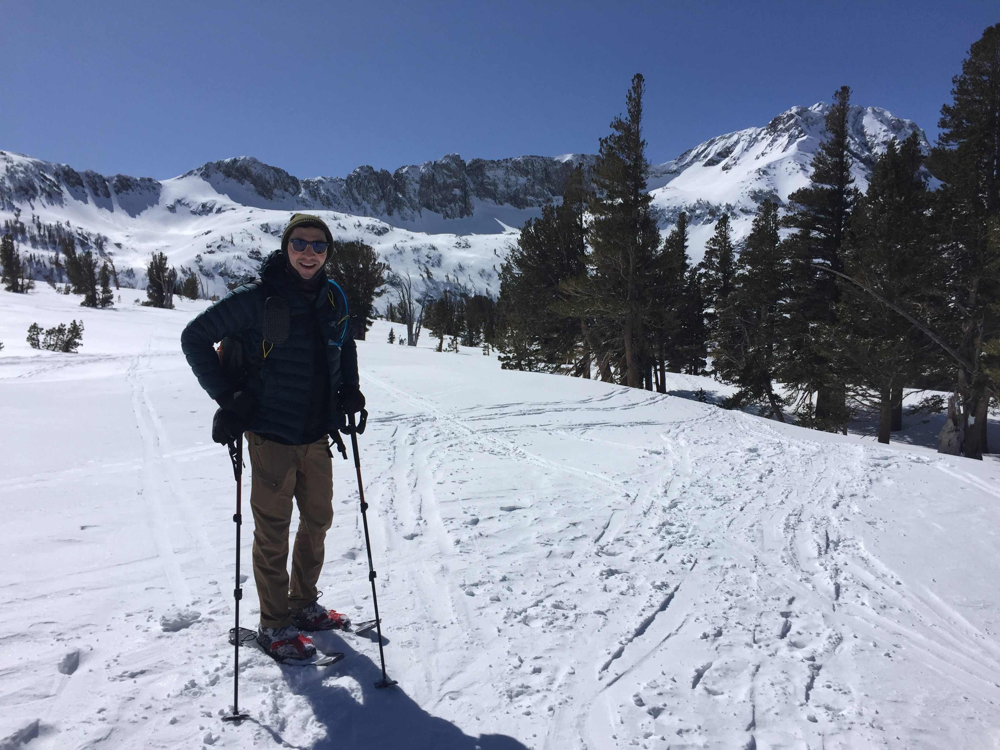

After working for nearly five years at the intersection of water science and policy in Washington, D.C., I decided to return to graduate school to develop a deeper understanding of water science and the mechanisms that impact water as it falls on the land. Much of this work focused on water management decisions affecting cities and people. While this is critically important, I am also deeply interested in understanding how water quantity and quality might change across ecosystems as they adapt to a climatic shifts. While at the Bren School, I have been exploring tools that can be used to manage increasingly irregular water supply while ensuring adequate quantities for environmental purposes. Water markets present an opportunity to work within the current water rights regime to help make decisions in a more nimble matter to help communities, economies and the environment adjust to less reliable and predictable climates.

This summer I was able to explore these interests while interning for AMP Insights, a consulting firm that specializes in economic services around water resources management. While interning, I had the opportunity to work on an analysis of water availability for farming in King County, Washington. This project involved identifying active farms using aerial photography and mapping it to existing water rights to determine where new water might be needed to support a local agriculture initiative.

Previous experience:

* Summer Analyst, AMP Insights
* Summer Analyst, Blue Forest Conservation
* Research Associate, Water Science and Technology Board, National Academies of Sciences, Engineering, and Medicine
* Program Assistant, American Association for the Advancement of Science
* Environmental Security Intern, Stimson Center

